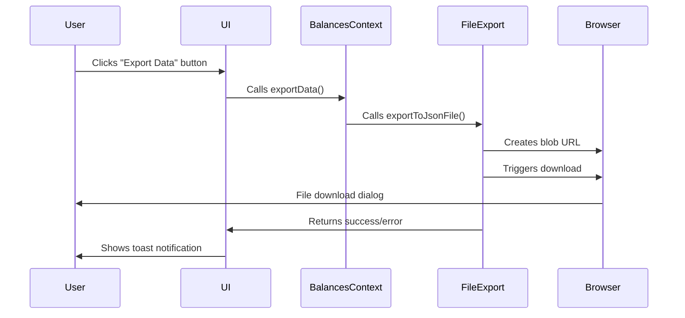
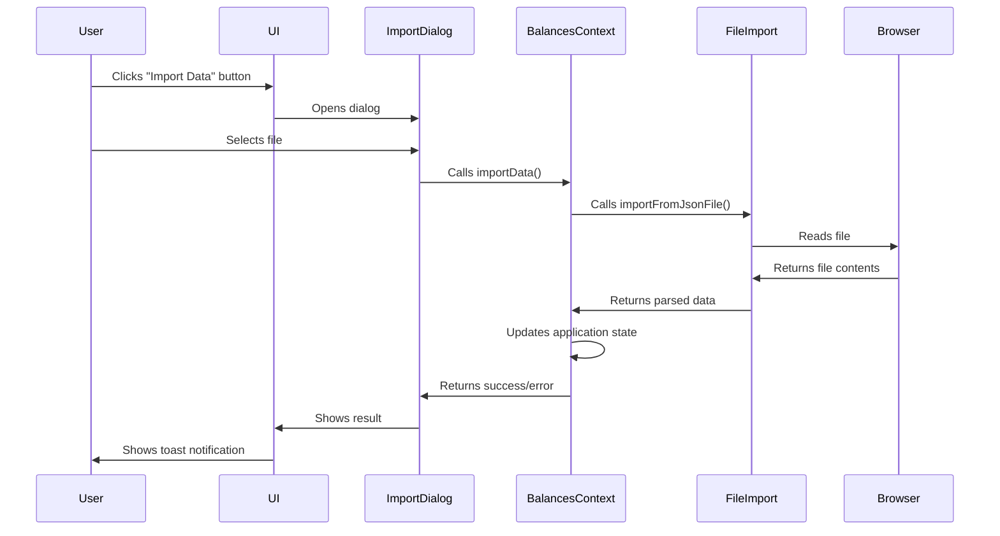
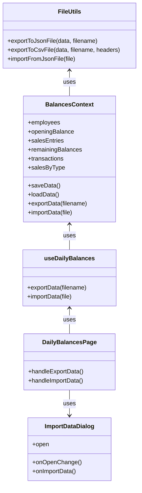

# Data Import/Export Feature

**Date:** 2023-09-10
**Feature:** Data Import/Export Functionality

## Description

This feature allows users to export their data (balances, transactions, etc.) to a JSON file that can be saved on their local machine, and also import previously exported data files. The functionality is performed client-side, which means no server interaction is required and all data is processed directly in the browser.

## Implementation Details

### File Import/Export Utils

- Created a utility module to handle file operations
- Supports exporting to both JSON and CSV formats
- Implemented file import functionality for JSON files
- Implemented proper error handling for all operations

### Context Integration

- Added `exportData` method to the BalancesContext
- Added `importData` method to the BalancesContext
- The exported/imported data includes:
  - Opening balances
  - Sales entries
  - Remaining balances
  - Transactions
  - Employee information
  - Export date
- Default filename includes current date (`mtnsyr-data-YYYY-MM-DD.json`)

### User Interface

- Added export buttons in strategic locations:
  - Main "Balances" tab - exports all data
  - Transactions tab - exports only transaction data with a dedicated filename
- Added import buttons in both tabs
- Created an ImportDataDialog component with drag-and-drop functionality
- Implemented validation for imported files
- User-friendly error messages

## User Flow - Export

1. User navigates to the application
2. User interacts with their data (adding transactions, etc.)
3. User clicks on the "Export Data" button
4. Browser initiates a file download with the appropriate name
5. User saves the file to their desired location
6. Feedback toast notification confirms success/failure

## User Flow - Import

1. User clicks on the "Import Data" button
2. Import dialog opens
3. User selects a previously exported JSON file
4. System validates the file format and data structure
5. If valid, the application state is updated with the imported data
6. Feedback toast notification confirms success/failure

## Sequence Diagram - Export

## Sequence Diagram - Import

## Class Diagram

